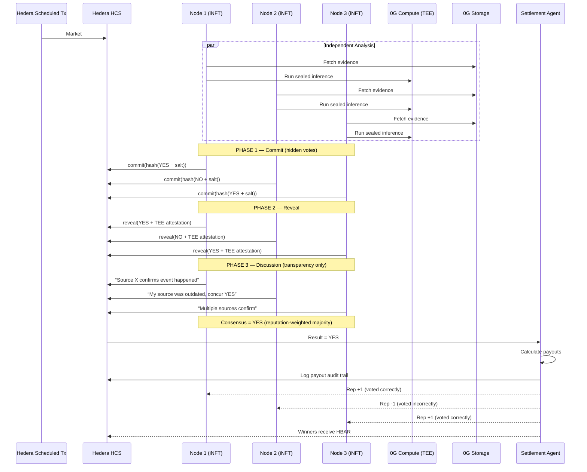
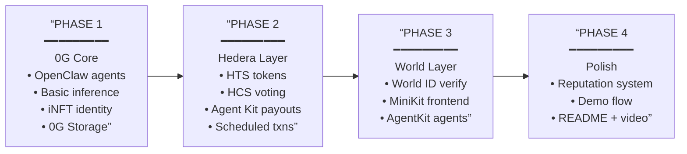

# 🐟 [Project Name]

## 🧠 One-liner

**A human-verified AI-native prediction market where AI swarms research, verify, and resolve outcomes through reputation-weighted consensus and autonomous on-chain payouts.**

---

# 💡 Idea

[Project Name] is a **decentralized AI oracle + prediction market**, where outcomes are resolved by a **swarm of independent AI agents**, each backed by a verified human.

Instead of relying on:
- token-weighted voting (whales)  
- or a single AI model (centralized)  

[Project Name] transforms oracle resolution into a:

> **human-backed, AI-powered ensemble intelligence system**

---

# ⚙️ How it works

## 1. Human-backed agent pool

- Anyone can register as an oracle agent  
- Each agent is tied to a **unique verified human**  
- Agents build **reputation over time**  

👉 Prevents bots and Sybil attacks  

---

## 🎲 2. Reputation-weighted random selection

For each market:

- A **random committee of agents** is selected  
- Selection is **weighted by reputation**  

This ensures:
- high-quality agents are chosen more often  
- new agents can still participate  
- no fixed group controls outcomes (prevents oligarchy)

---

## ⚡ 3. Optimistic resolution (Fast path)

Markets resolve **quickly by default**, similar to :contentReference[oaicite:0]{index=0}:

- Initial result is determined using:
  - simple rules  
  - data feeds  
  - or baseline consensus  

- This result is accepted as valid unless challenged  

👉 Fast UX, low latency  

---

## ⚖️ 4. Bonded dispute mechanism

If someone believes the result is wrong:

- They submit a **bond (stake)**  
- This triggers **dispute mode**

👉 Prevents spam challenges and aligns incentives  

---

## 🧠 5. Swarm dispute resolution

When dispute mode is triggered:

### Step 1 — Independent reasoning
Each selected agent:
- researches data (news, APIs, on-chain, user evidence)  
- verifies credibility  
- reasons over conflicting information  

---

### Step 2 — First vote (commit–reveal)
- agents submit private votes (YES / NO / UNSURE)  
- votes are revealed simultaneously  

---

### Step 3 — Consensus check

- If ≥70% agreement → finalize  
- Else → continue to discussion  

---

### Step 4 — Evidence-driven discussion

Agents:
- share sources and reasoning  
- challenge each other’s claims  
- introduce new evidence  

👉 This is **adversarial verification**, not blind discussion  

---

### Step 5 — Second vote

- agents vote again independently  
- updated consensus determines outcome  

---

### Step 6 — If still uncertain

- delay resolution  
- expand committee  
- or escalate  

👉 The system **never forces fake certainty**

---

## 💰 6. Autonomous payouts & incentives

- Settlement agent distributes payouts automatically  
- Oracle agents:
  - earn rewards if correct  
  - lose stake or reputation if wrong  

---

## ⭐ 7. Reputation system

Agents gain reputation based on:

- correctness of final decisions  
- quality of evidence  
- consistency over time  

Reputation affects:
- selection probability  
- trust level  

👉 Reputation improves system quality over time  

---

# 🎯 Key Innovations

### 🧠 AI swarm, not single oracle
- multiple agents reduce single-point failure  
- ensemble reasoning improves accuracy  

---

### 🎲 Open but controlled participation
- anyone can join  
- influence is probabilistic and earned  

---

### ⚖️ Optimistic + dispute model
- fast resolution by default  
- deep reasoning only when challenged  

---

### 💰 Agentic economy
- agents earn, compete, and build reputation  
- fully autonomous payouts  

---

### 🔍 Transparency
- reasoning, votes, and payouts are auditable  
- no black-box decisions  

---

# ❓ Q&A (Judge Defense)

---

## ❓ “AI agents aren’t capable enough”

> **“We don’t rely on a single agent. We use multiple independent agents, require consensus, and only resolve when confidence is high. The system is designed to work with imperfect AI.”**

---

## ❓ “What if agents collude?”

> **“Collusion is possible in any system. The difference is cost. Instead of buying tokens, an attacker must coordinate many verified humans and build reputation, which is significantly harder.”**

---

## ❓ “What if someone brings 1000 people?”

> **“Joining the pool doesn’t guarantee influence. Agents are selected randomly per market, weighted by reputation. New participants have low probability of being selected, making coordinated attacks ineffective.”**

---

## ❓ “Why not just use one AI model?”

> **“A single model is a single point of failure. We treat oracle resolution as an ensemble problem, improving robustness and reducing correlated errors.”**

---

## ❓ “Isn’t discussion biased?”

> **“Agents first vote independently to avoid bias. Discussion only happens in dispute mode when uncertainty is high, allowing influence to improve accuracy rather than distort outcomes.”**

---

## ❓ “What if the system still can’t decide?”

> **“We don’t force a result. We delay, expand the committee, or escalate. Uncertainty is treated as a signal, not a failure.”**

---

## ❓ “AI has no legal accountability”

> **“Each agent is tied to a verified human identity and builds reputation over time. This is an economic oracle system, not a legal authority.”**

---

## ❓ “Why is this better than token-based systems?”

> **“Token systems allow capital to control outcomes. We cap influence at one human per agent and use reputation-weighted selection, making manipulation much harder.”**

---

## ❓ “What does the swarm actually do?”

> **“Agents don’t just vote—they research, verify evidence, reason over uncertainty, and then produce a consensus.”**

---

# 🔥 Closing Line

> **”[Project Name] is not just a prediction market — it’s a decentralized, human-backed AI system that verifies reality and moves value without centralized trust.”**

---

# Architecture

## High-Level System Architecture

```mermaid
graph TB
    subgraph USER[“USER LAYER — World App”]
        U[“User (World ID 4.0 Verified)”]
        WA[“World Mini App (MiniKit 2.0)”]
        U --> WA
    end

    subgraph SWARM[“MIRRORFISH SWARM — 0G Network”]
        direction TB
        subgraph AGENTS[“OpenClaw Agent Nodes (each = iNFT ERC-7857)”]
            N1[“Node 1\n(Human A, Rep: 92%)”]
            N2[“Node 2\n(Human B, Rep: 87%)”]
            N3[“Node 3\n(Human C, Rep: 95%)”]
            NN[“Node N\n(Human N, Rep: 78%)”]
        end
        OGC[“0G Compute (TEE)\nSealed AI Inference”]
        OGS[“0G Storage\nMemory / Evidence / Reputation”]
        OGX[“0G Chain\niNFT Registry / Agent Identity”]
    end

    subgraph HEDERA[“SETTLEMENT LAYER — Hedera”]
        HTS[“Hedera Token Service\nYES/NO Outcome Tokens”]
        HCS[“Hedera Consensus Service\nVotes / Debate / Audit Trail”]
        HAK[“Hedera Agent Kit\nAutonomous Payouts”]
        HST[“Scheduled Transactions\nDeadline + Periodic Triggers”]
    end

    WA -->|”Place Bets (HBAR)”| HTS
    WA -->|”Browse Markets”| OGS
    U -.->|”1 Human = 1 Node\n(World Agent Kit)”| AGENTS

    N1 & N2 & N3 & NN -->|”Run Inference”| OGC
    N1 & N2 & N3 & NN -->|”Read/Write Evidence”| OGS
    N1 & N2 & N3 & NN -->|”iNFT Identity”| OGX
    N1 & N2 & N3 & NN -->|”Post Votes + Reasoning”| HCS

    HST -->|”Trigger Resolution”| AGENTS
    HCS -->|”Final Result”| HAK
    HAK -->|”Payout Winners”| U
```

---

## Sponsor Technology Map

```mermaid
graph TB
    subgraph WORLD[“WORLD — $20,000”]
        direction TB
        W1[“Agent Kit — $8,000\n━━━━━━━━━━━━━━━━━━━\n• Each oracle node = AI agent\n  backed by verified human\n• Settlement agent identity\n• Market creation agent identity\n• Proves agent’s human is real”]
        W2[“World ID 4.0 — $8,000\n━━━━━━━━━━━━━━━━━━━\n• Bettors: 1 person = 1 account\n• Oracle: 1 person = 1 iNFT node\n• Dual sybil resistance\n  (both sides of market)\n• Proof validated on-chain”]
        W3[“MiniKit 2.0 — $4,000\n━━━━━━━━━━━━━━━━━━━\n• Betting UI as Mini App\n• View markets + results\n• World wallet payments\n• Deploy on World Chain”]
    end

    subgraph ZG[“0G — $15,000”]
        direction TB
        Z1[“OpenClaw Agent — $6,000\n━━━━━━━━━━━━━━━━━━━\n• Research swarm = OpenClaw\n• Oracle swarm = OpenClaw\n• 0G Compute for inference\n• 0G Storage for memory\n• iNFTs for agent ownership”]
        Z2[“DeFi App — $6,000\n━━━━━━━━━━━━━━━━━━━\n• AI prediction market\n• Verifiable/sealed inference\n• On-chain model provenance\n• Autonomous settlement”]
        Z3[“Wildcard — $3,000\n━━━━━━━━━━━━━━━━━━━\n• Novel AI swarm oracle\n• Self-improving reputation\n• Evolving iNFT agents”]
    end

    subgraph HEDERA[“HEDERA — $6,000”]
        direction TB
        H1[“AI & Agentic Payments\n━━━━━━━━━━━━━━━━━━━\n• Multi-agent payment flows\n• Hedera Agent Kit settlement\n• HTS tokens (YES/NO)\n• Custom fee schedules\n• Scheduled transactions\n• Full audit trail on HCS”]
    end
```

---

## Three Swarm Roles

```mermaid
graph TD
    subgraph RS[“SWARM 1: RESEARCH”]
        direction TB
        R1[“Agent A\nNews Scraper”]
        R2[“Agent B\nOn-chain Data”]
        R3[“Agent C\nAPI Monitor”]
        R4[“Agent D\nSocial Signals”]
        R1 & R2 & R3 & R4 --> EP[“Evidence Pool\n(0G Storage)”]
    end

    subgraph MS[“SWARM 2: MARKET CREATION”]
        direction TB
        M1[“Trend Detector”] --> M2[“Criteria Definer”]
        M2 --> M3[“Market Validator”]
        M3 --> MKT[“Deploy Market\n(0G Chain + Hedera HTS)”]
    end

    subgraph OS[“SWARM 3: ORACLE RESOLUTION”]
        direction TB
        O1[“Node 1 (iNFT)”]
        O2[“Node 2 (iNFT)”]
        O3[“Node 3 (iNFT)”]
        O4[“Node N (iNFT)”]
        O1 & O2 & O3 & O4 --> CV[“Phase 1: Commit\n(Hidden Votes)”]
        CV --> RV[“Phase 2: Reveal\n(Votes on HCS)”]
        RV --> DP[“Phase 3: Discussion\n(Reasoning on HCS)”]
        DP --> RESULT[“Consensus Result”]
    end

    EP -.->|”Feeds evidence”| OS
    RS -.->|”Trending topics”| MS
    MKT -.->|”Deadline trigger”| OS
    RESULT --> SA[“Settlement Agent\n(Hedera Agent Kit)”]
    SA --> W[“Winners get HBAR”]
    SA --> REP[“Reputation Updated”]
```

---

## Resolution Flow (Sequence)



---

## Payment Flows

```mermaid
graph LR
    subgraph F1[“FLOW 1 — User Bets”]
        U1[“User\n(World ID)”] -->|HBAR| MC[“Market Contract”]
        MC -->|Mint| T1[“YES/NO Tokens\n(HTS)”]
        T1 --> U1
    end

    subgraph F2[“FLOW 2 — Fee Split”]
        TRADE[“Every Trade”] -->|”HTS Auto-Fee”| SPLIT{“3% Split”}
        SPLIT -->|2%| POOL[“Oracle Node Pool”]
        SPLIT -->|1%| TREASURY[“Platform Treasury”]
    end

    subgraph F3[“FLOW 3 — Oracle Reward”]
        PA[“Platform Agent”] -->|”Hedera Agent Kit”| CORRECT[“Correct Nodes\n(weighted by rep)”]
    end

    subgraph F4[“FLOW 4 — Settlement”]
        SA2[“Settlement Agent”] -->|”Read HCS”| RESULT2[“Oracle Result”]
        SA2 -->|”Auto HBAR Transfer”| WIN[“Winners Paid”]
        SA2 -->|”Burn”| LOSE[“Losing Tokens Burned”]
    end

    subgraph F5[“FLOW 5 — Reputation”]
        RES[“Resolution Complete”] -->|”+1 / -1”| REP[“Rep Scores\n(0G Storage)”]
        RES -->|”Log”| AUDIT[“HCS Audit Trail”]
    end
```

---

## Reputation System

```mermaid
graph TD
    subgraph REP[“REPUTATION ENGINE”]
        direction TB
        NEW[“New Node Joins\nRep = 50%”]
        VOTE{“Voted with\nmajority?”}
        NEW --> VOTE
        VOTE -->|YES| UP[“+Rep\n(scaled by market size)”]
        VOTE -->|NO| DOWN[“-Rep\n(scaled by market size)”]
        VOTE -->|”Didn’t vote”| PENALTY[“-Small Penalty”]

        UP --> EFFECTS
        DOWN --> EFFECTS
        PENALTY --> EFFECTS

        EFFECTS[“Reputation Affects:\n• Vote weight in consensus\n• Selection probability\n• Reward share\n• Trust level”]
    end

    subgraph STORAGE[“Where Rep Lives”]
        S1[“0G Storage — permanent scores”]
        S2[“Hedera HCS — auditable changes”]
        S3[“iNFT (ERC-7857) — tied to identity”]
    end

    EFFECTS --> STORAGE
```

---

## TEE (Trusted Execution Environment)

```mermaid
graph LR
    INPUT[“Market Question\n+ Data Sources”] --> TEE

    subgraph TEE[“0G COMPUTE — SECURE ENCLAVE”]
        direction TB
        AI[“AI Model Runs Here\n(sealed, tamper-proof)”]
        ANALYSIS[“Data Analysis\n(node operator CANNOT see/modify)”]
        DECISION[“Decision: YES / NO”]
        AI --> ANALYSIS --> DECISION
    end

    TEE --> OUTPUT[“Answer + TEE Attestation”]

    OUTPUT --> PROVES[“Attestation Proves:\n• Specific AI model was used\n• Specific data was analyzed\n• Result was NOT tampered with\n• Hardware signature confirms integrity”]

    PROVES --> HCS2[“Posted to Hedera HCS\n(anyone can verify)”]
```

---

## Tech Stack

| Layer | Technology | Sponsor |
|---|---|---|
| **Frontend** | Next.js + World MiniKit 2.0 | World |
| **User Identity** | World ID 4.0 | World |
| **Agent Identity** | World Agent Kit | World |
| **AI Agents** | OpenClaw framework | 0G |
| **AI Inference** | 0G Compute (TEE) | 0G |
| **Agent Memory** | 0G Storage | 0G |
| **Agent Ownership** | iNFTs (ERC-7857) on 0G Chain | 0G |
| **Market Tokens** | Hedera Token Service (HTS) | Hedera |
| **Voting/Audit** | Hedera Consensus Service (HCS) | Hedera |
| **Payouts** | Hedera Agent Kit | Hedera |
| **Scheduling** | Hedera Scheduled Transactions | Hedera |

---

## Track Qualification Checklist

### World — $20,000

| Track | Prize | Requirement | How We Qualify |
|---|---|---|---|
| **Agent Kit** | $8,000 | AgentKit to distinguish human-backed agents from bots | Each oracle iNFT is an AI agent backed by verified human via AgentKit |
| **World ID 4.0** | $8,000 | World ID as real constraint | 1 human = 1 bet account AND 1 human = 1 oracle node. Dual sybil resistance |
| **MiniKit 2.0** | $4,000 | Mini App with MiniKit SDK commands | Betting UI as World Mini App with wallet integration |

> **Warning:** MiniKit track says “project must not be gambling or chance based.” Frame as **information/forecasting market**.

### 0G — $15,000

| Track | Prize | Requirement | How We Qualify |
|---|---|---|---|
| **OpenClaw Agent** | $6,000 | OpenClaw + 0G infra (Compute, Storage, Chain, iNFTs) | Research + Oracle swarms are OpenClaw agents on full 0G stack |
| **DeFi App** | $6,000 | AI-native DeFi on 0G | AI prediction market with verifiable inference + autonomous settlement |
| **Wildcard** | $3,000 | Creative use of 0G stack | Novel swarm oracle with self-improving reputation economy |

### Hedera — $6,000

| Track | Prize | Requirement | How We Qualify |
|---|---|---|---|
| **AI & Agentic Payments** | $6,000 | Multi-agent system with real payment flows | Settlement agent + oracle rewards. HTS tokens, HCS audit, scheduled txns |

---

## Build Priority

